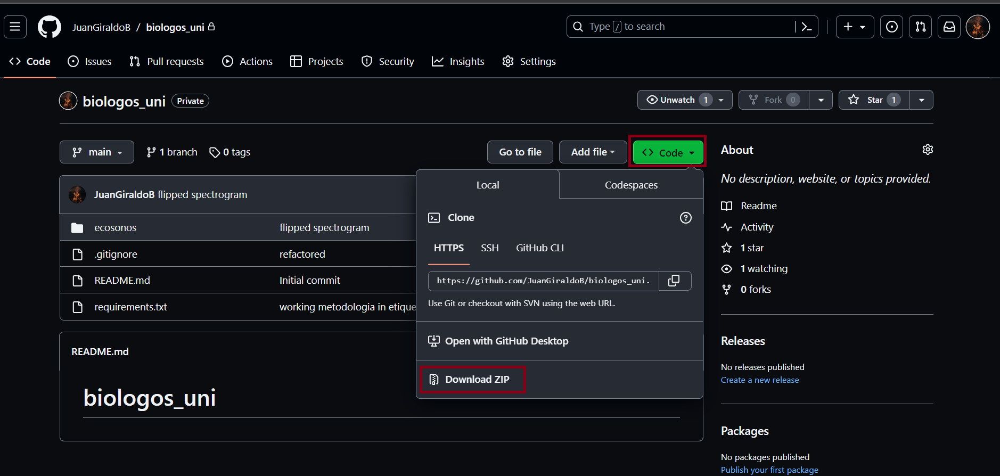

# biologos_uni

Siga estos pasos para configurar y ejecutar el proyecto localmente.


### Prerrequisitos

- Python 3.10 (https://www.python.org/downloads/release/python-3100/)
- OPCIONAL: Git (para clonar el repositorio)

### Instalación

1. Clone el repositorio en su máquina local:

   ```bash
   git clone https://github.com/JuanGiraldoB/biologos_uni.git

   o descárguelo como un archivo ZIP.


2. Ingrese a la consola en la ubicación donde se encuentra el proyecto

3. Cree un entorno virtual de Python:

    ```bash
   python -m venv venv

4. Active el entorno virtual:

    * En Windows:
        ```bash
        venv\Scripts\activate

    * En macOS and Linux
        ```bash
        source venv/bin/activate

5. Instale las dependencias del proyecto desde requirements.txt:

    ```bash
    pip install -r requirements.txt


### Ejecución de la Aplicación
1. Navegue al directorio del proyecto que contiene el archivo manage.py:
    ```bash
    cd ecosonos

2. Inicie el servidor:
    ```bash
    python manage.py runserver

3. Abra un navegador web y vaya a:
    ```
    http://localhost:8000\
